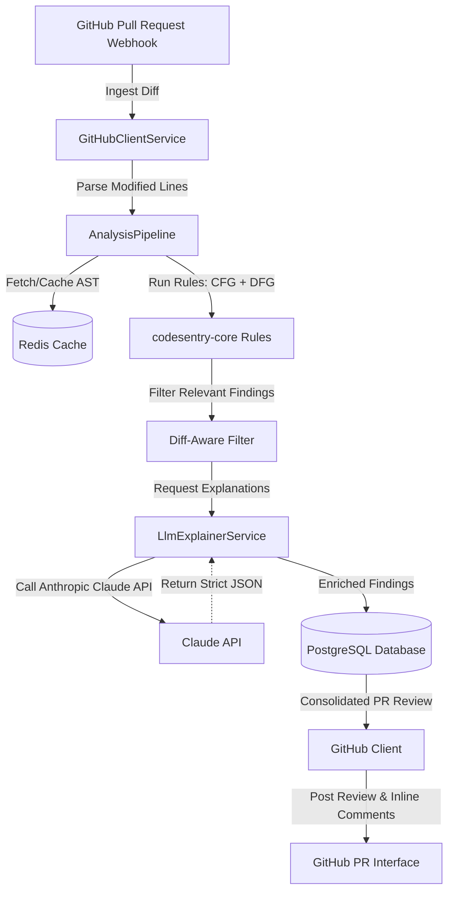
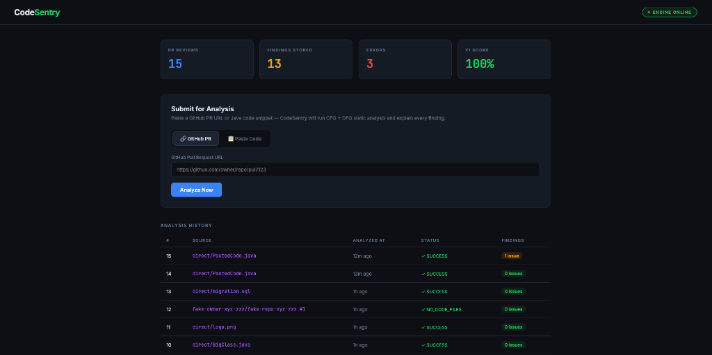
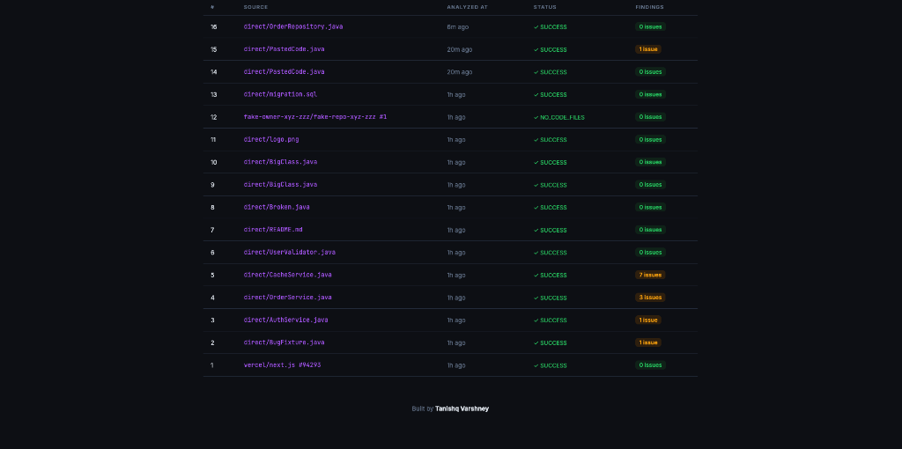
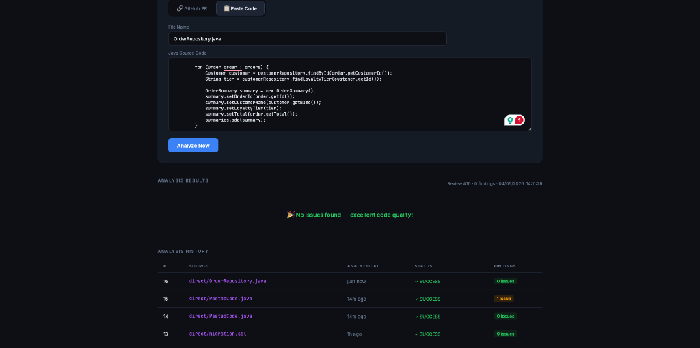
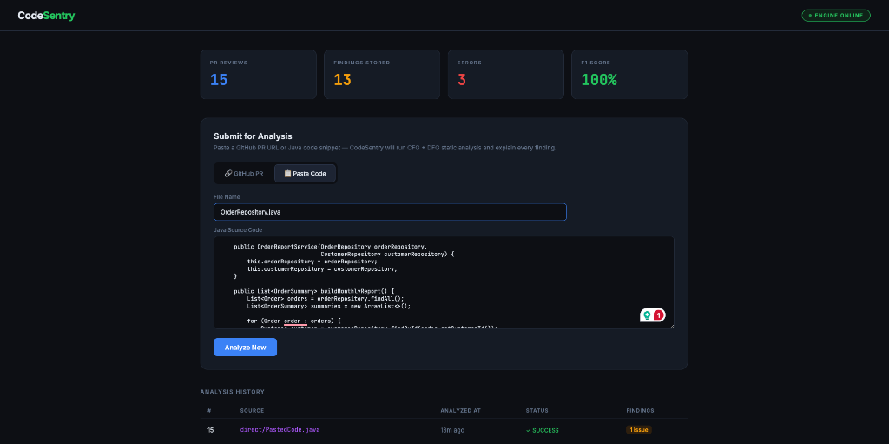
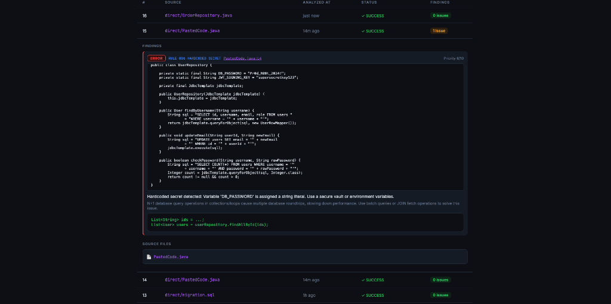

# CodeSentry: AI-Powered Static Code Review Assistant

CodeSentry is an AI-powered static code analysis platform that integrates deep local static analysis (CFG/DFG tracing) with Large Language Models (LLMs) to provide precise, structured, and contextual code review feedback.

Unlike typical LLM code review tools that act as simple prompt wraps, CodeSentry runs a **genuine static analysis engine first**, generates structured mathematical findings, and uses the LLM (Anthropic Claude API) solely to explain the bug, assign a priority score, and generate a concrete patch.

---

## Key Features

1. **Deep Static Analysis Engine**
   - **Control-Flow Graph (CFG)**: Full structural parsing including loop constructs, branch splits, and `try-catch-finally` handling.
   - **Data-Flow Graph (DFG)**: Iterative worklist-based solver implementing reaching definitions to track variable definition-to-use scopes.
2. **Pluggable Analysis Rules**
   - **Resource Leak Detection**: Tracks `AutoCloseable` declarations to verify that they are closed or escaped along all exit paths.
   - **Null Safety Dereference**: Path-sensitive null-guard tracker that flags dereferences of variables that could be null.
   - **Concurrency Hazards**: Flags unguarded fields in Spring components, non-atomic check-then-act sequences on collections, and unsafe collection publication in getters.
   - **N+1 Database Queries**: Detects database calls executed inside loops or Stream iterations (e.g., `map`, `forEach`).
3. **Diff-Aware Scoping**
   - Parses incoming unified diffs and restricts feedback strictly to lines touched by the PR, or lines that changed code's dataflow reaches.
4. **Resilient LLM Explainer & Schema Enforcement**
   - Leverages Anthropic Claude messages API with strict JSON schema parsing and extraction fallback guards.
5. **Caching & DB History**
   - Uses **Redis** to cache JavaParser AST configurations, reducing parsing overhead.
   - Uses **PostgreSQL** to persist historical runs and reviews.
6. **Benchmark Suite**
   - Computes execution latency, analysis throughput (files/sec), precision, recall, and F1 score against a set of seeded-bug test files.

---

## Architectural Workflow



---

## Project Structure

```
├── pom.xml                        # Parent Maven Descriptor (JDK 17+)
├── codesentry-core/               # Pure Java analyzer (CFG, DFG, Rules)
├── codesentry-app/                # Spring Boot Service (Webhooks, Redis, JPA, LLM)
├── codesentry-benchmark/          # Benchmark suite (Accuracy/Latency evaluation)
├── Dockerfile                     # Multi-stage container build
└── docker-compose.yml             # Local db, cache, and app stack
```

---

## Setup & Running Local Development

### Prerequisites
- JDK 17+
- Maven 3.9+
- Docker & Docker Compose

### 1. Compile & Test core module
To verify the engine rules compile and pass core integration tests:
```bash
mvn clean test
```

### 2. Run the Benchmark Suite
To measure performance and accuracy:
```bash
mvn install -DskipTests
mvn exec:java -pl codesentry-benchmark -Dexec.mainClass=org.codesentry.benchmark.BenchmarkHarness
```

### 3. Run using Docker Compose
To launch the full pipeline (PostgreSQL, Redis, and Spring Boot Web App):
```bash
# Set your Anthropic API Key (or leave blank to run in simulated mock mode)
export ANTHROPIC_API_KEY="your-anthropic-api-key"

docker-compose up --build
```
The application will start on port `8080`.

---

## Webhook API Integration
GitHub webhook events should point to:
```http
POST http://localhost:8080/webhook/github
```
Headers:
- `X-GitHub-Event: pull_request`
- `X-Hub-Signature-256: sha256=<hmac-signature>`
- `Content-Type: application/json`

---

### Analysis Dashboard


### Walkthrough Demo Video


### History View


### Submit for Analysis


### Code Findings


### Recent Analyses

